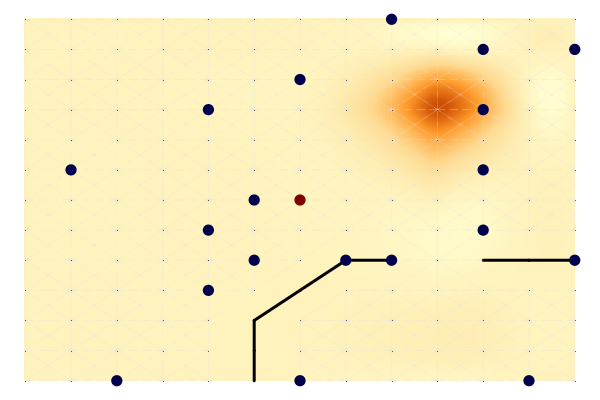
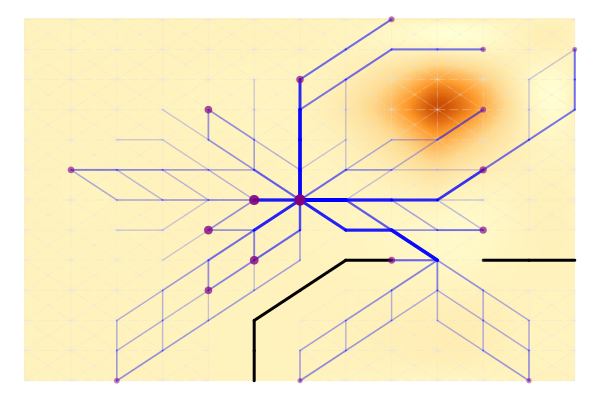

# OptimalTransportNetworks.jl
**Optimal Transport Networks in Spatial Equilibrium - in Julia and MATLAB**

***
*Note*: Library is under development, no guarantees whatsoever. Contributions welcome!
***

Modern Julia ([JuMP](https://github.com/jump-dev/JuMP.jl)) translation of the MATLAB OptimalTransportNetworkToolbox (v1.0.4b) implementing the quantitative spatial economic model of:

Fajgelbaum, P. D., & Schaal, E. (2020). Optimal transport networks in spatial equilibrium. *Econometrica, 88*(4), 1411-1452.

The model/software uses duality principles to optimize over the space of networks, nesting an optimal flows problem and a neoclasical general-equilibrium trade model into a global network design problem to derive the optimal (welfare maximizing) transport network (extension) from any primitive set of economic fundamantals [population per location, productivity per location for each of *N* traded goods, endowment of a non-traded good, and (optionally) a pre-existing transport network]. 

The model is the first of its kind and a pathbreaking contribution towards the welfare maximizing planning of transport infrastructure. Its creation has been funded by the European Union through an [ERC Research Grant](https://cordis.europa.eu/project/id/804095). The author of this Julia library has no personal connections to the authors, but has used their Matlab library for research purposes and belives that it is an important contribution that deserves an accessible open source implementation. Community efforts to further improve the code are welcome. In particular, there is a probabilistic extenstion to solving the model using MCMC methods which may be more suitable for large networks, implemented in:

Kreindler, G., Gaduh, A., Graff, T., Hanna, R., & Olken, B. A. (2023). Optimal Public Transportation Networks: Evidence from the World's Largest Bus Rapid Transit System in Jakarta (No. w31369). National Bureau of Economic Research.

## Example

The code for this example is in [example04.jl](https://github.com/SebKrantz/OptimalTransportNetworks.jl/blob/main/examples/example04.jl). 

This plot shows the endowments on a map-graph: circle size is population, circle colour is productivity (the central node is more productive), the black lines indicate geographic barriers, and the background is shaded according to the cost of network building (elevation), indicating a mountain in the upper right corner. 

This plot shows the optimal network after 200 iterations, keeping population fixed and not allowing for cross-good congestion. The size of nodes indicates consumption in each node. 

